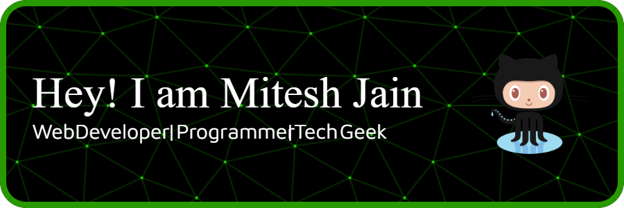

<h2 align="left">Hi, my name is Mitesh Jain</h2>

###

  
  
  
  
  
  
  
  
  
  
  
  
  
  
  
  
  
  
  
  
  
  
  
  
  
  
  
  
  
  
  
  
  
  
  
  
  
  
  
  
  
  
  
  
  

###

- 🌱 I’m currently learning **AI/ML, Backend, DSA**

- 💬 Ask me about **Web Development, AWS, DSA**

- 📫 How to reach me **miteshjain2808@gmail.com**

- ⚡ Fun fact **I love optimizing code/UI**

 

 

  

  

 

&nbsp;

 

###
